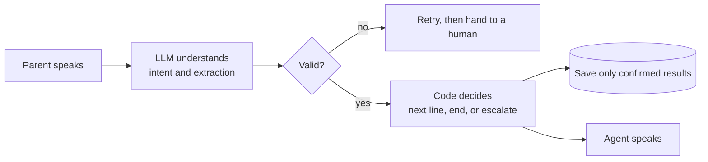
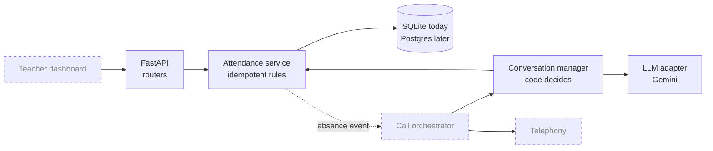

<div align="center">



<br>

[](https://github.com/Aditya9122002/Attendance-Ai/actions/workflows/ci.yml)


**An open-source, multilingual AI assistant that phones a parent when a student is marked absent,
understands the reply, and puts the reason and return date on the teacher's dashboard.**

[How it works](#how-it-works) ·
[Status](#status) ·
[Getting started](#getting-started) ·
[API](#api) ·
[Design principles](#design-principles) ·
[Roadmap](#roadmap)

</div>

---

## Why this exists

When a student is absent, a teacher or office staff member usually phones the parent, one by one,
and writes down what they hear. It is slow, it happens late, and some families never get called.

AttendanceAI automates that call. It speaks the parent's language, asks why the child is absent,
confirms what it heard, and records a **validated, structured result**. Anything it cannot resolve
becomes a task for a human. It never silently drops a case.

> **Project status: prototype.** This is a learning-driven build, developed stage by stage with tests
> at every step. It is not ready to call real parents. See [Status](#status) and
> [Privacy and safety](#privacy-and-safety).

## How it works

1. **A teacher marks a student absent.** The API stores the attendance record and creates exactly
   one absence event, even if the request is repeated or two requests race.
2. **The assistant calls the parent.** It introduces itself as an automated assistant, confirms it is
   speaking to the right person, and only then mentions the child.
3. **The parent replies in their own words**, in English, Hindi, Marathi or a mix. A language model
   turns the reply into a small validated record: a reason category, an optional return date, and a
   flag for anything that needs a human.
4. **The assistant reads the result back** ("So Asha was absent because of illness and will return
   on Monday. Is that right?"). Only a confirmed result is saved.
5. **The teacher sees the outcome** on the dashboard, including calls that need follow-up.

### The key idea: the AI understands, the code decides

A language model is good at understanding messy speech and bad at following safety rules every
single time. So the model only **classifies what the parent said**. Plain, fully tested code
**decides what happens next**: what to say, when to end the call, and what is allowed to be saved.



## Status

| Stage | What | State |
|:--:|---|:--:|
| 0 | Foundations: config, logging, CI | ✅ Done |
| 1 | Data model, migrations, teacher API, exactly-once absence event | ✅ Done |
| 2 | LLM extraction with eval sets, results stored on the event | ✅ Done |
| 3 | Conversation manager: decision logic with safety rules | 🚧 In progress |
| 4 | Teacher dashboard (React) and real authentication | ⏳ Planned |
| 5-6 | Audio fundamentals, streaming speech-to-text and text-to-speech | ⏳ Planned |
| 7 | Real phone calls through telephony | ⏳ Planned |
| 8-13 | Hardening, five languages, parent Q&A, WhatsApp, production, multi-agent | ⏳ Planned |

Details live in [`docs/development-roadmap.md`](docs/development-roadmap.md).

## Architecture



Dashed boxes are planned and not built yet.

| Layer | Technology |
|---|---|
| Language and runtime | Python 3.12, fully async |
| Web framework | FastAPI, Pydantic v2 |
| Database | SQLAlchemy 2 (async), Alembic migrations, SQLite for development |
| LLM | Gemini through a small `LlmClient` interface, so providers can be swapped |
| Tooling | uv, Ruff, pytest, GitHub Actions |

## Getting started

**Prerequisites:** [uv](https://docs.astral.sh/uv/) and Git. uv installs the right Python (3.12) for you.

```powershell
git clone https://github.com/Aditya9122002/Attendance-Ai.git
cd Attendance-Ai
uv sync
Copy-Item .env.example .env        # macOS/Linux: cp .env.example .env
uv run alembic upgrade head        # creates the local SQLite database
uv run uvicorn app.main:app --reload --app-dir backend
```

Open <http://127.0.0.1:8000/docs> for the interactive API documentation, and
<http://127.0.0.1:8000/health> for a liveness check.

> The API needs a school and a student in the database before the attendance endpoints do anything
> useful. There is no endpoint to create them yet; a demo seed and a terminal call simulation are
> planned as part of Stage 3.

### Configuration

Settings come from environment variables, with `.env` for local development only. Never commit `.env`.

| Variable | Default | Purpose |
|---|---|---|
| `APP_ENV` | `development` | `development`, `test` or `production`. Production switches logs to JSON. |
| `LOG_LEVEL` | `INFO` | `DEBUG`, `INFO`, `WARNING` or `ERROR` |
| `DATABASE_URL` | `sqlite+aiosqlite:///./attendance.db` | Database connection string |
| `GEMINI_API_KEY` | *(empty)* | Needed only to run the live LLM scripts. Tests never need it. |
| `GEMINI_MODEL` | `gemini-3.1-flash-lite` | Model used by the scripts. Chosen by measurement, see [Quality](#quality-and-evaluation). |

### Run the checks

These are the same three checks CI runs. Run them before every commit.

```powershell
uv run ruff check .
uv run ruff format --check .
uv run pytest
```

## API

| Method | Path | What it does |
|---|---|---|
| `GET` | `/health` | Liveness probe |
| `PUT` | `/students/{student_id}/attendance/{day}` | Set a student's attendance for a day. Repeating the request is safe. |
| `GET` | `/attendance/{day}` | Every student of the school with their status and call result for the day |

```powershell
$headers = @{ "X-School-Id" = "<school-uuid>" }
Invoke-RestMethod -Method Put -Headers $headers -ContentType "application/json" `
  -Body '{"status":"absent"}' `
  -Uri "http://127.0.0.1:8000/students/<student-uuid>/attendance/2026-10-01"
```

```json
{
  "student_id": "…",
  "attendance_date": "2026-10-01",
  "status": "absent",
  "event_status": "pending",
  "correction_notice_owed": false
}
```

> ⚠️ **No authentication yet.** The school is read from an `X-School-Id` header, which anyone can
> send. This is a development placeholder and must be replaced with real login (Stage 4) before any
> real data goes near this API.

A student of another school and a student that does not exist both return `404`, so the API cannot
be used to discover which student IDs exist elsewhere.

## Design principles

- **AI understands, code decides.** Safety rules are plain code covered by tests, never left to a prompt.
- **Exactly once, enforced by the database.** A unique constraint on attendance records, plus an
  atomic compare-and-set on the event status, makes repeated and racing requests harmless.
- **Tenant safety at the lowest level.** Every table carries `school_id`, and composite foreign keys
  mean the database itself refuses a link between two different schools.
- **Privacy by design.** The model sees only the parent's reply, never a name. Only the extracted
  category and date are stored, never what the parent said. Logs hold IDs only.
- **Never guess.** Unclear or invalid output is retried a bounded number of times and then handed
  to a human. An unconfirmed result is never saved.
- **Measured, not assumed.** Prompts and models are chosen with labelled eval sets, including a
  holdout set, and every run is logged.

## Quality and evaluation

- **Tests** cover the service rules, the API, migrations (including a drift check that fails if the
  models and migrations disagree), the extraction pipeline, the conversation logic and the scoring.
  Safety rules such as "no child details before the caller is confirmed" are tested on every path.
- **CI** runs Ruff and pytest on every push and pull request.
- **Eval sets** in [`evals/`](evals) hold made-up parent replies in English, Hindi, Marathi and
  Hinglish, with emergencies, bereavements, ASR-style typos and prompt-injection attempts. The runner
  reports accuracy and, separately, the safety numbers that matter most, such as **missed emergencies**.

| Date | Model | Prompt | Cases | All fields correct | Missed emergencies |
|---|---|---|:--:|:--:|:--:|
| 2026-10-02 | `gemini-3.1-flash-lite` | v1 (baseline) | 36 | 89% | 0 |

Every run is recorded in [`docs/eval-log.md`](docs/eval-log.md).

```powershell
uv run python scripts/eval_extraction.py --dry-run      # prove the scoring works, no key needed
uv run python scripts/eval_extraction.py --model <id>   # real run, needs GEMINI_API_KEY
```

## Privacy and safety

**Built and tested:**
- The assistant introduces itself as automated and names the school and the guardian, never the child,
  until the caller confirms who they are.
- An opt-out, a wrong number, a request for a human, an upset parent or an emergency always overrides
  the normal flow.
- Extraction output is schema-validated. Failures go to a human, never to a guess.

**Not built yet, and required before any real use:**
- Real authentication and per-school access control.
- Enforcing opt-outs in the dialer, calling-hours rules, retries and escalation notifications.
- Verifying current telephony rules for calling Indian numbers, and consent and recording disclosure
  under the DPDP Act for children's data.
- A paid LLM tier with proper data terms. Free tiers may use prompts to improve products, so
  **development uses made-up data only.**

## Project structure

```
Attendance-Ai/
├── backend/
│   ├── app/
│   │   ├── main.py                  # FastAPI app and lifespan
│   │   ├── config.py                # typed settings
│   │   ├── logging_config.py        # JSON or text logs
│   │   ├── database.py              # async engine and session
│   │   ├── models.py                # ORM models
│   │   ├── attendance_service.py    # idempotent marking, event lifecycle, results
│   │   ├── extraction.py            # parent reply to validated data
│   │   ├── conversation.py          # call decision logic and safety rules
│   │   ├── evaluation.py            # eval scoring
│   │   ├── dependencies.py          # session and current-school dependencies
│   │   ├── routers/attendance.py    # teacher-facing endpoints
│   │   └── llm/                     # LlmClient interface, Gemini adapter, test fake
│   └── migrations/                  # Alembic
├── evals/                           # labelled eval sets
├── scripts/                         # live smoke test and eval runner
├── tests/
└── docs/                            # product docs, roadmap, decision records, eval log
```

## Documentation

| Document | What is in it |
|---|---|
| [`docs/product-understanding.md`](docs/product-understanding.md) | Problem, personas, scope, risks, principles |
| [`docs/product-workflow.md`](docs/product-workflow.md) | Call flow, conversation script, edge cases |
| [`docs/product-discovery.md`](docs/product-discovery.md) | Questions for schools, compliance checklist, pilot plan |
| [`docs/development-roadmap.md`](docs/development-roadmap.md) | The staged plan |
| [`docs/decisions/`](docs/decisions) | Short records of major technical decisions |

## Roadmap

1. Finish the conversation manager and a terminal simulation where you play the parent.
2. Teacher dashboard with real login.
3. A first real phone call, starting simple and moving to streaming audio.
4. Retries, callbacks, emergency escalation and notifications.
5. Hindi, Marathi, Tamil, Gujarati and English, with per-language evals.
6. Parent Q&A, WhatsApp and email, analytics, and multiple agents.

## Contributing

This is a learning project, but ideas and issues are welcome. Please keep changes small, add tests,
and run the three checks above before opening a pull request. Commits use short, meaningful
messages such as `feat: ...`, `fix: ...` and `docs: ...`.

## License

[MIT](LICENSE)