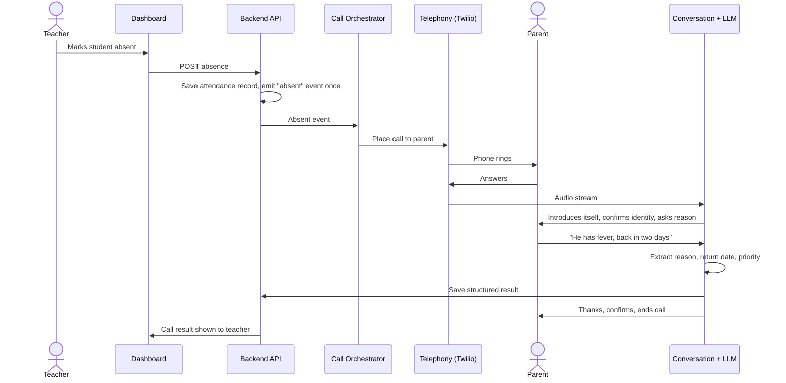
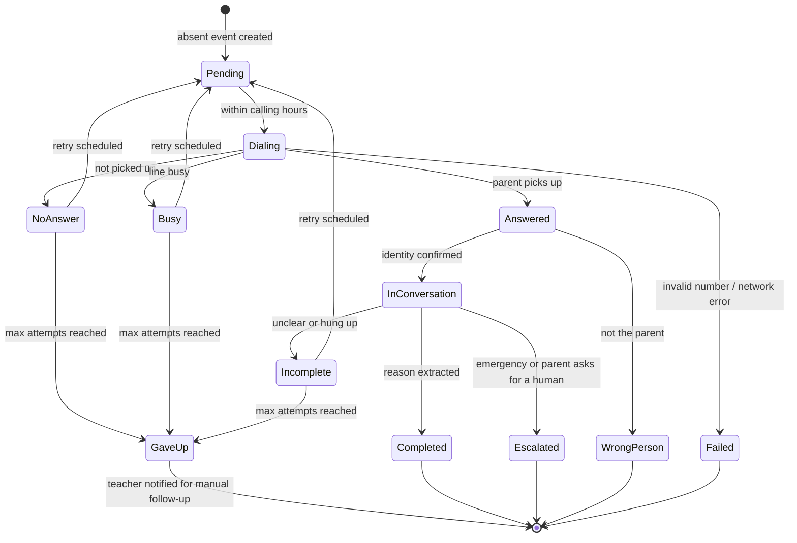
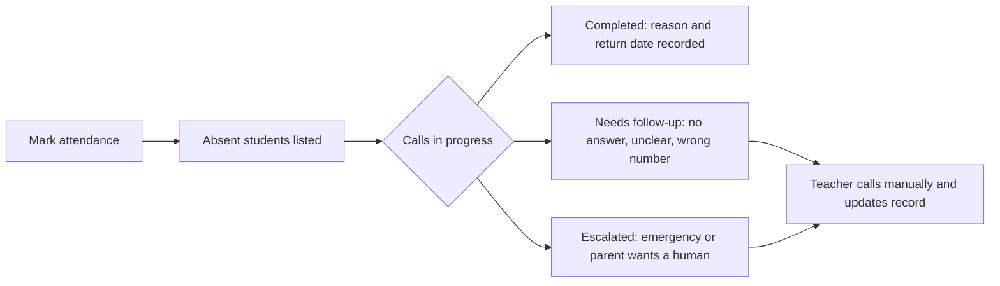
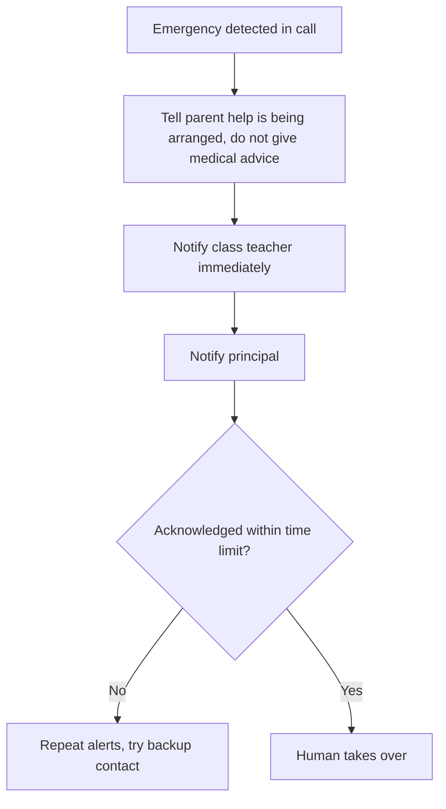

# Product Workflow: AttendanceAI

> Diagrams use Mermaid. They render on GitHub, and in VS Code with the
> "Markdown Preview Mermaid Support" extension.
> Numbers like retry counts and calling hours are **starting proposals**, to be set with schools.

## 1. The happy path, end to end



## 2. Call lifecycle (states)



**Every final state is visible to the teacher**, and anything the AI could not resolve
becomes a task for a human. That is a core promise: the system never silently drops a case.

## 3. The conversation script (English version)

The exact wording will be tuned per school, but the structure is fixed:

1. **Introduce.** "Hello, this is an automated assistant calling from [School Name]."
   It must say it is an AI and mention the school, because parents will not trust an unknown caller.
2. **Confirm identity.** "Am I speaking with a parent or guardian of a student at [School Name]?"
   Do **not** say the child's name or that they are absent until the caller confirms.
3. **State the purpose.** "We noticed [Child] was not in school today. Could you tell me the reason?"
4. **Listen.** Allow the parent to interrupt (barge-in) and speak freely.
5. **Clarify if needed.** Ask one short follow-up: "When do you expect [Child] to return?"
6. **Confirm.** Repeat back: "So [Child] has a fever and will return on Thursday. Is that right?"
7. **Close.** Thank them, say the teacher has been informed, end the call.

At any point, "I want to speak to the teacher" leads to escalation, and silence or repeated
misunderstanding leads to a polite goodbye plus a human follow-up task.

## 4. What the AI extracts

```json
{
  "reason_category": "illness",
  "reason_detail": "fever",
  "expected_return_date": "2026-10-02",
  "priority": "normal",
  "needs_human_followup": false,
  "confidence": 0.92,
  "language": "hi"
}
```

- `reason_category`: illness, family_event, travel, transport_issue, other, unknown.
- `priority`: normal, high, emergency. Emergency covers serious illness, accident, or
  the parent not knowing where the child is.
- `confidence`: low confidence sets `needs_human_followup` to true.
- The output is **validated against a schema** before it touches the database.
  If validation fails, the call is marked for human follow-up, never guessed.

## 5. Edge cases and how we handle them

| Situation | Behaviour |
|---|---|
| No answer | Retry later (proposal: up to 3 attempts, spaced hours apart) |
| Busy | Same as no answer |
| Voicemail or answering machine | Do not leave details about the child. Retry, then notify the teacher |
| Wrong number / wrong person | Apologise, end call, flag the number as wrong, no child details shared |
| Parent says "call later" | Schedule a callback at their preferred time |
| Parent does not want automated calls | Record the opt-out, stop calling, notify the school |
| Parent gives a vague answer | Ask one clarifying question, then mark incomplete |
| Parent is upset or abusive | Stay calm, escalate to a human |
| Emergency (accident, hospital, child missing) | Escalate immediately to teacher and principal |
| Parent asks something out of scope | "I will pass that to the teacher", create a task |
| Bad audio or long silence | Apologise, retry once, then give up politely |
| Same absence marked twice | Idempotency: only one call sequence per absence |
| Teacher corrects a mistake (student was present) | Cancel the pending call, or mark the record corrected |
| Call outside allowed hours | Wait until the calling window opens |

## 6. Teacher's day, from the dashboard



Dashboard screens (Stage 4):
1. **Today**: absent students with live call status.
2. **Student profile**: parent contacts, absence history, past call summaries and transcripts.
3. **Needs attention**: escalations and failed calls, sorted by priority.
4. **Settings**: calling hours, language, school name used in the greeting.

## 7. Escalation path (Version 2)



## 8. Later versions, how the workflow grows

| Version | New behaviour |
|---|---|
| 2 | Emergency detection and escalation |
| 3 | Hindi, Marathi, Tamil, Gujarati, English, and mixed speech like Hinglish |
| 4 | Parent asks "what homework is pending?", the AI looks it up and answers |
| 5 | Parent asks about policies, holidays, PTM dates, and gets answers grounded in school documents |
| 6, 7 | Same agent over WhatsApp and email |
| 8 | Analytics dashboard: absence patterns, response rates, cost |
| 9 | Separate agents for attendance, homework, fees and transport, with a router |

## 9. Data flow and privacy rules

- The call audio and transcript belong to the school. Retention period is a school decision.
- **No child details before the caller is confirmed.**
- Logs contain IDs, never phone numbers, names or transcripts.
- Free-tier AI APIs get **fake data only** during development.
- Consent and recording disclosure follow current Indian rules. We verify these before any pilot.